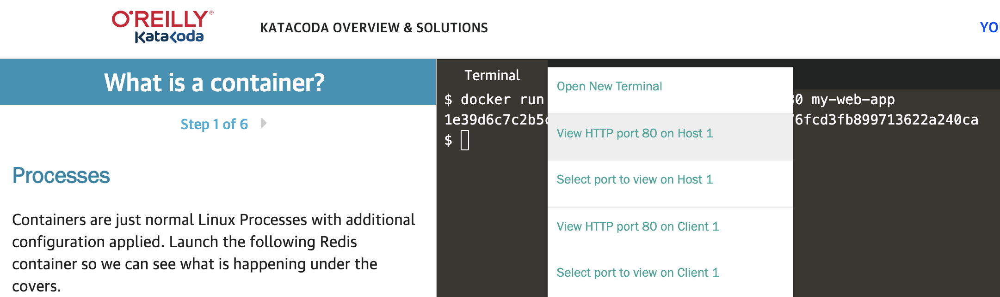

# Exploring docker
In this lab, you will learn how to 
- Create a simple static web application
- Create a docker file
- Package application as a docker image
- Create a docker image
- Create a container from that image
- Check container statistics
- Navigate inside container and execute commands

> We will use Katacoda to run this lab. Go to https://www.katacoda.com/courses/container-runtimes/what-is-a-container. Execute the following commands in the terminal.

> Run the following command to create a HTML page
```
cat <<EOF > index.html
<html>
  <body>
      <div>Welcome to Kickstart K8s in a day!</div>
  </body>
</html>
EOF
```
> Create docker file
```
cat <<EOF > Dockerfile
FROM ubuntu
RUN apt-get update
RUN apt-get install nginx -y
COPY index.html /var/www/html/
EXPOSE 80
CMD ["nginx","-g","daemon off;"]
EOF
```

> Create an image
```
docker build -t my-web-app .
docker images
```

> Create a container from the image. Container is an instance of the image.
```
docker run -d --name my-web-app1 -p 80:80 my-web-app
docker ps
```
> Check the website by clicking "+" button next to "Terminal" and select "View HTTP port 80 on Host 1"



## Optional: Execute commands inside one of the containers.
```
docker exec -it my-web-app1 /bin/bash
ls
exit
```

## Optional: Upload the docker image to Docker Hub. 
> Signup on https://hub.docker.com/.
> Enter user id annd password when prompted
```
docker login
```
> Tag the image and upload to Docker Hub (Container registry) 
```
docker tag my-web-app <docker-hub-user-name>/my-web-app:latest
docker push <docker-hub-user-name>/my-web-app:latest
```
> Check if the image is uploaded successfully https://hub.docker.com/repository/docker/<docker-hub-user-name>/my-web-app
