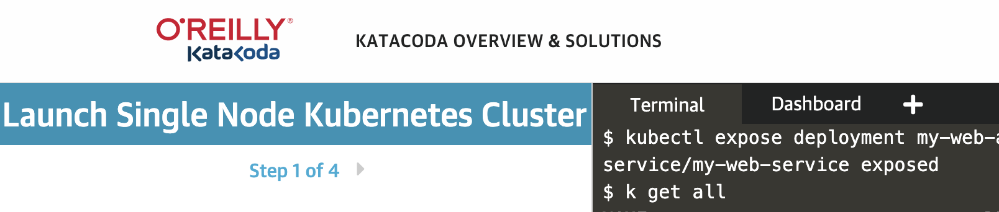
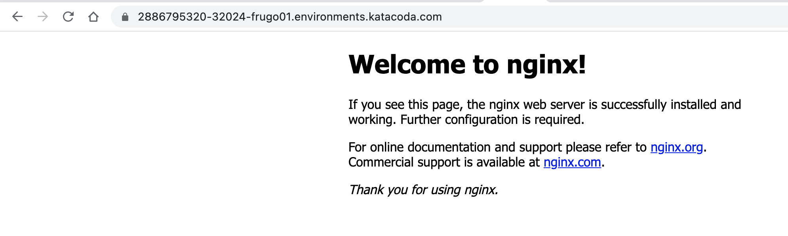

# Creating and Exploring Services and Endpoints
> Go to https://www.katacoda.com/courses/kubernetes/launch-single-node-cluster. Enter the following commands in the terminal.
Please use CTRL+click (on Windows and Linux) or CMD+click (on MacOS) to open the following links in a new browser tab.

## Create a deployment to associate with the service 
> Create a deployment manifest with 2 replicas
```
cat <<EOF > dep.yml
apiVersion: apps/v1
kind: Deployment
metadata:
  name: my-web-app
  labels:
    app: k8s-class
spec:
  replicas: 2
  selector:
    matchLabels:
      app: my-web-app
  template:
    metadata:
      labels:
        app: my-web-app
    spec:
      containers:
      - name: ui
        image: nginx
        ports:
        - containerPort: 80
EOF
```
> Create deployment
```
kubectl apply -f dep.yml
```

## Imperative way: Create a ClusterIP service 
> Run the following command to create a cluster ip service
```
kubectl expose deployment my-web-app --type=ClusterIP --name=my-web-service --port=80 --target-port=80
```

> Explore Cluster ip services
> You can get "pod-ip-address" from `kubectl get pod -o wide` command.
> You can get "cluster-ip-address" from `kubectl get svc -o wide` command.
```
kubectl get services
kubectl get svc
kubectl get svc -o wide
kubectl describe svc my-web-service
kubectl get svc -n kube-system

curl http://<pod-ip-address>
curl http://<cluster-ip-address>
curl http://my-web-service
```

> Explore endpoints. Endpoints are backend to Services. One end point is created for each Pod the service is serving. 
```
kubectl get endpoints
kubectl get ep
```

> Delete service
```
kubectl delete svc my-web-service
```

## Declarative way: Create a ClusterIP service 
> Create a service manifest file
```
cat <<EOF > service.yml
apiVersion: v1
kind: Service
metadata:
  name: my-web-service
spec:
  selector:
    app: my-web-app
  ports:
    - protocol: TCP
      port: 80
      targetPort: 80
EOF
```

> Create service
```
kubectl apply -f service.yml
```

> Explore service
```
kubectl get svc -o wide
```

> Delete service
```
kubectl delete svc my-web-service
```

--- 

## Imperative way: Create a NodePort service 
> Run the following command to create a cluster ip service
```
kubectl expose deployment my-web-app --type=NodePort --name=my-web-service --port=80 --target-port=80
```

> Explore Cluster ip services
> You can get "pod-ip-address" from `kubectl get pod -o wide` command.
> You can get "cluster-ip-address" from `kubectl get svc -o wide` command.
```
kubectl get services my-web-service
curl http://my-web-service
```

> Check http://<node-public-ip>:<node-port>
> You can get "node-port" from `kubectl get svc my-web-service` "<node-port>:80"
> Check the website by clicking "Dashboard" tab as shown below and enter the node-port value.

> You can now access the web app externally.


> Delete service
```
kubectl delete svc my-web-service
```

## Declarative way: Create a NodePort service 
> Create a service manifest file
```
cat <<EOF > service2.yml
apiVersion: v1
kind: Service
metadata:
  name: my-web-service
spec:
  type: NodePort
  selector:
    app: my-web-app
  ports:
    - protocol: TCP
      port: 80
      targetPort: 80
      nodePort: 30001
EOF
```

> Create service
```
kubectl apply -f service2.yml
```

> Explore service
```
kubectl get svc -o wide
```

> Delete service
```
kubectl delete svc my-web-service
```