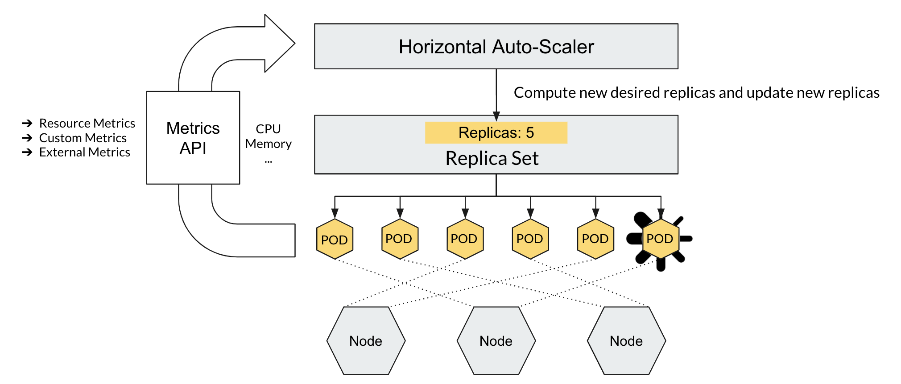

# Scaling deployments
> Go to https://www.katacoda.com/courses/kubernetes/launch-single-node-cluster. Enter the following commands in the terminal.
Please use CTRL+click (on Windows and Linux) or CMD+click (on MacOS) to open the following links in a new browser tab.
## Imperative way: Manual Scaling out and in 
> Run the following command to scale out replicas from 2 to 10
```
kubectl create deployment my-web-app --image=nginx
kubectl get rs,pods -o wide
kubectl scale deployment/my-web-app --replicas=10
kubectl get rs -o wide -w
```

> Run the following command to scale in replicas from 10 to 2
```
kubectl scale deployment/my-web-app --replicas=2
```
> Check new pods creation in watch mode
```
kubectl get pods -o wide -w
```
CTRL+C to exit

> Delete deployment
```
kubectl delete deploy my-web-app
```

## Declarative way: Manual Scaling out and in
> Create a service manifest file
```
cat <<EOF > dep-manual-scaling.yml
apiVersion: apps/v1
kind: Deployment
metadata:
  name: my-web-dep
  labels:
    app: k8s-class
spec:
  replicas: 10
  selector:
    matchLabels:
      app: my-web-app
  template:
    metadata:
      labels:
        app: my-web-app
    spec:
      containers:
      - name: ui
        image: nginx
        ports:
        - containerPort: 80
EOF
```

> Scale up with manifest file
```
kubectl apply -f dep-manual-scaling.yml
```

> Delete deployment
```
kubectl delete deploy my-web-dep
```

--- 
# Autoscaling

## Install Metrics Server
```
minikube addons list
minikube addons enable metrics-server

git clone https://github.com/linuxacademy/metrics-server.git
kubectl create -f metrics-server/deploy/1.8+/

kubectl convert -f https://raw.githubusercontent.com/linuxacademy/metrics-server/master/deploy/1.8%2B/metrics-server-deployment.yaml | kubectl create -f -
```
> The above takes few minutes to gather metrics. If you don't see statistics, try after 2-3 minutes.
> The following commannd should show the current CPU and Memory staus for the pods in Kube-system namespace (Kuberenetes control plane.)
```
kubectl top pods -n kube-system
kubectl top nodes
```

## Pod resource requests and limits
> Check node resources available
> User "node-name" from `kubectl get nodes` command
> Check for the CPU and memory available on the node
```
kubectl get nodes
kubectl describe node <node-name>
```

> Create deployment with resource requests and limits
```
cat <<EOF > dep-auto-scale.yml
apiVersion: v1
kind: Service
metadata:
  name: my-web-service
spec:
  type: NodePort
  selector:
    app: my-web-app
  ports:
    - protocol: TCP
      port: 80
      targetPort: 80
      nodePort: 30001
---
apiVersion: apps/v1
kind: Deployment
metadata:
  name: my-web-dep
  labels:
    app: k8s-class
spec:
  replicas: 2
  selector:
    matchLabels:
      app: my-web-app
  template:
    metadata:
      labels:
        app: my-web-app
    spec:
      containers:
      - name: ui
        image: nginx
        ports:
        - containerPort: 80
        resources:
          requests:
            memory: "200Mi"
            cpu: "100m"
          limits:
            memory: "400Mi"
            cpu: "200m"
EOF
```
> Create deployment
```
kubectl apply -f dep-auto-scale.yml
```

> Imperative - Horizontal pod autoscaling
```
kubectl get pods -o wide
kubectl autoscale deployment/my-web-app --min=1 --max=10 --cpu-percent=50
kubectl get hpa -w

```

> Open a new terminal and run the following command to load test the application to check if new pods are getting created.
> siege -t2M -c100 - siege for 2 minutes with 100 concurrent connections.
```
sudo apt install siege
siege -t2M -c100 http://<cluster-ip>

```

> Watch if new pods are created from the first terminal.
> You should see the table as shown in the following picture.
```
$ k get hpa -w
NAME         REFERENCE               TARGETS   MINPODS   MAXPODS   REPLICAS   AGE
my-web-app   Deployment/my-web-app   0%/20%    1         10        1          8m47s
my-web-app   Deployment/my-web-app   18%/20%   1         10        1          9m22s
my-web-app   Deployment/my-web-app   202%/20%   1         10        1          10m
my-web-app   Deployment/my-web-app   202%/20%   1         10        4          10m
my-web-app   Deployment/my-web-app   202%/20%   1         10        8          10m
my-web-app   Deployment/my-web-app   202%/20%   1         10        10         11m
my-web-app   Deployment/my-web-app   126%/20%   1         10        10         11m
```
> Delete deploy, hpa
```
kubectl delete hpa my-web-app
kubectl delete svc my-web-service
kubectl delete deploy my-web-dep
```